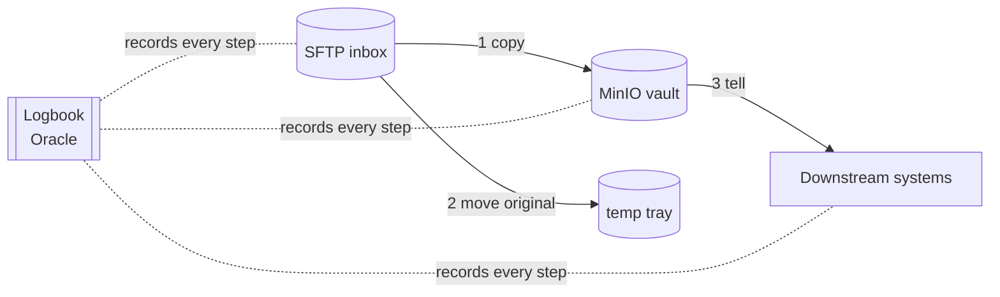
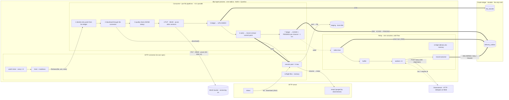
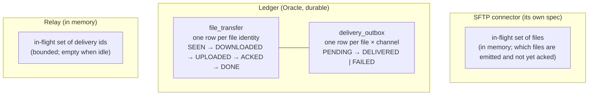
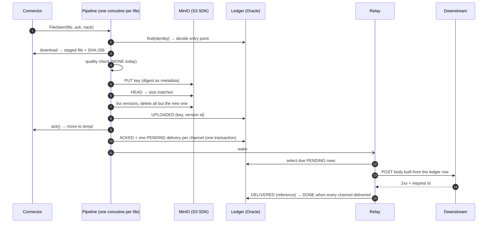
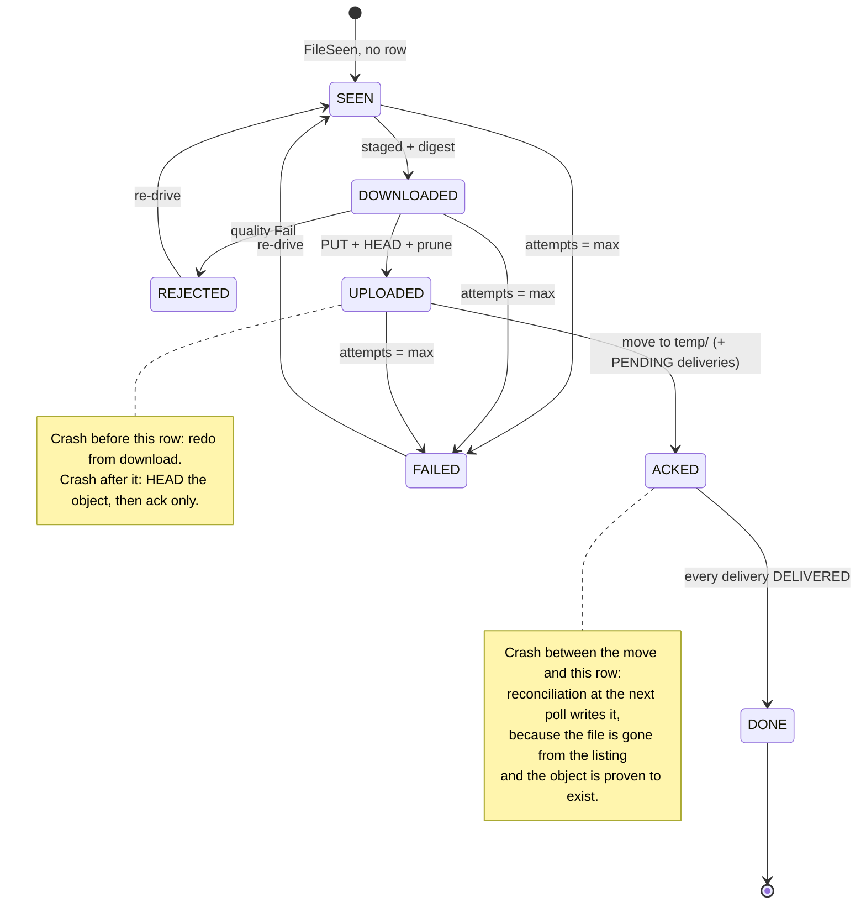
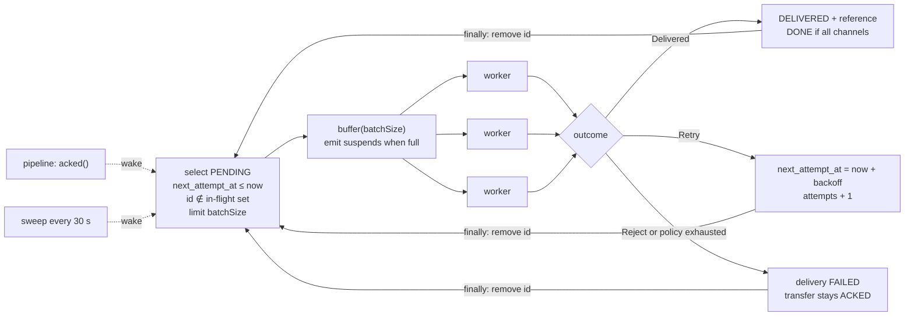

# SFTP Ingest - The Picture

Companion to `spec.md`. The spec is the authority; this page exists so a reader gets the shape
in five minutes and knows which five decisions carry the requirements. Section numbers below
point into the spec.

---

## Part 1 - For everyone

### The job, as a mailroom

Every hour a courier checks an inbox on the SFTP server. For each envelope in it, the courier:

1. **Copies** it into the vault (the MinIO bucket) and checks the copy is complete.
2. **Stamps** the original and moves it to the "done" tray on the same server (the temp folder,
   which downstream empties on its own schedule).
3. **Tells** everyone who cares (the downstream systems) that the copy is in the vault.

The whole time, the courier writes every step for every envelope in a **logbook** (the ledger,
two tables in Oracle). If the courier collapses halfway, the next courier opens the logbook,
sees exactly where each envelope stopped, and continues from there. Nothing is done twice
unless the logbook could not be written in time, and nothing is ever skipped.

### The three promises

| Promise | How it is kept |
|---|---|
| **Nothing is lost.** | A file leaves the inbox only after its copy is verified in the vault. The move is the last thing done to the original. A crash before the move leaves the file where it was, to be redone. |
| **Nobody is told too early.** | The notification is written to the logbook in the same stroke as "moved", and a separate loop sends it. It can only ever be sent after the copy exists and the original is moved. |
| **One bad envelope never stops the rest.** | Each file is handled on its own. A file that fails five times is marked FAILED, left in the inbox, and an operator decides. A file that fails quality is marked REJECTED the same way. Neither is ever deleted. |

### What can go wrong, and why it is fine

| If the courier collapses... | ...the next courier | Cost |
|---|---|---|
| while copying | copies again | one extra copy, overwritten |
| after copying, before writing it down | copies again | one extra copy, overwritten |
| after writing "copied", before moving | checks the vault, then moves | none |
| after moving, before writing "moved" | notices the file is gone from the inbox, writes "moved" | the notification waits one hour |
| after telling downstream, before writing it down | tells them again | downstream sees the same file id twice and ignores the repeat |

That table is the whole safety argument. Every row is a test (spec 17.2, S2 to S5).

---

## Part 2 - For engineers

### The whole system in one picture

One process, three components, four things outside it. The connector owns the server side of
the conversation and hands each ready file to the consumer as an event with an ack and a nack.
The pipelines do the work for one file and write every step to the ledger. The relay is a
second, independent loop that turns ledger rows into downstream calls. The pipelines and the
relay never talk to each other except through the ledger and one wake signal, which is what
lets either be restarted without the other noticing.

Thick edges are the durable commit path; dotted edges are signals or responses, never data;
the two memory boxes are the only state that must not survive a restart.

### Three pieces of state, three owners

Everything else is stateless and can be restarted at any moment.

- The **connector** remembers only which files it has emitted and not yet heard back about.
  It never persists anything (connector D14).
- The **ledger** is the single source of truth for what happened to a file. File identity is
  name + size + mtime (D2).
- The **relay's set** is not a cache and not a store: it is a "these rows are taken" guard so
  a delivery in flight is not selected twice (spec 7.4).

### One file's journey

The ack (step 9) is the **commit point** for the source: it is the last write to the original,
and it happens only after the copy is verified (I10). Everything after it is made reliable by
the outbox, not by ordering (D6).

### The state machine, with the crash points

Entry points are decided from the ledger on every `FileSeen` (spec 4.3): anything below
UPLOADED restarts from download; UPLOADED and above verify the object and ack; REJECTED and
FAILED are nacked without work.

### The second loop: the relay

A cold `Flow` with `buffer` and `flatMapMerge`, not a `SharedFlow`: a shared flow broadcasts
to every subscriber, drops values when nobody is collecting, and never completes, each of
which is wrong for a work queue (D7). The buffer bounds memory to `batchSize + parallelism`
rows; cancellation leaves rows PENDING, which is the correct shutdown.

### The five decisions that carry the requirements

Ranked. If you read nothing else in the spec, read these entries in its decision log.

| # | Decision | Requirement it carries | Spec |
|---|---|---|---|
| 1 | **The ledger is the only truth; the connector persists nothing.** | No data loss across a crash; at-least-once with a known resume point for every file. | D1, 4.3, 4.4 |
| 2 | **Ack is the commit; deliveries are created in the ACKED transaction; reconciliation repairs move-then-crash.** | Nobody is told before the file is safe; the notification is durable the instant the source is committed. | D6, 4.5, I10, I11 |
| 3 | **Deterministic key, prune every other version after every PUT.** | "Delete the old version if we upload twice" on a bucket whose versioning cannot be turned off; a retry is an overwrite, never a sibling. | D5, 6.3, I6 |
| 4 | **Cold-flow relay with a bounded buffer and an in-memory in-flight guard; per-channel policy; a failed delivery never fails the file.** | High throughput without unbounded memory; one slow channel never blocks another; a dead downstream is a dead-letter, not a stuck pipeline. | D7, D9, 7.3, 7.4, I4, I5, I13 |
| 5 | **Every timeout below the drain; bounded parallelism everywhere; one replica.** | Stability: a pod restart at any moment converges (I8); shutdown is bounded (I12); the five-session cap on the server is respected. | 3.3, 11.2, D13, I14 |

### Where each requirement lands

| Requirement from the brief | Where |
|---|---|
| Run hourly, all files under one folder | connector `watch(dir, every = 1h)`, overlap SKIP (spec 9, D12) |
| Move to temp after processing | connector `onAck = move("temp/")`, called only after UPLOADED (4.1, I10) |
| Quality check seam, no-op today | `QualityCheck.NONE` on the complete staged file (8, D11) |
| Download, upload, delete old version, notify | stages 1 to 5, prune in stage 3 (4.1, 6.3) |
| Multiple notification channels | `DeliveryChannel` seam, one outbox row per channel, HTTP first (7) |
| No data lost | crash matrix and I8 (4.4, 17.1) |
| High performance | bounded parallel pipelines, relay batch and buffer, S13 load scenario (9, 7.3) |
| High stability | failure model, startup checks, ordered shutdown (10, 11) |

### What is deliberately not here

No second replica, no streaming, no attempt-history table, no content parsing for the body,
no bucket or table creation, no Quarkus scheduler. Each has a named seam or a recorded reason
in spec 14 and 15.
