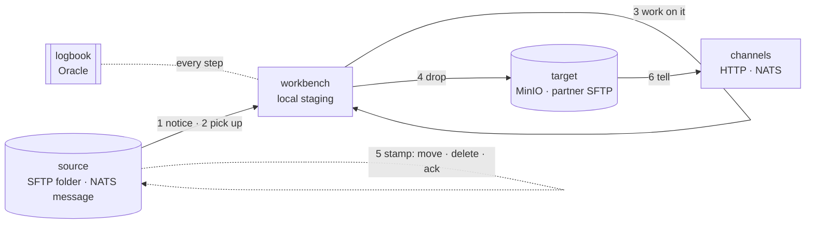
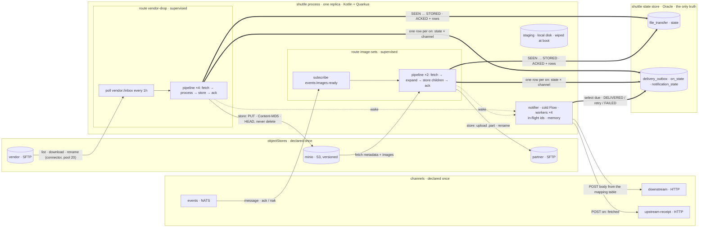
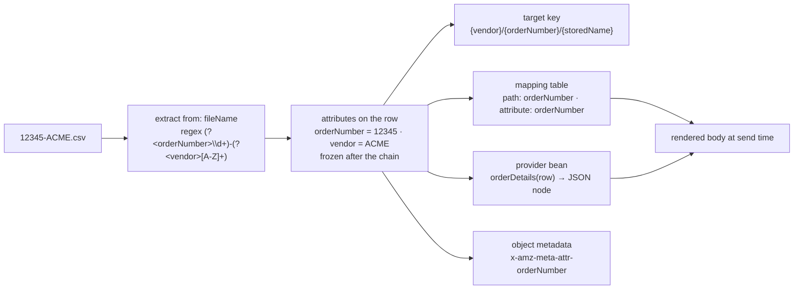
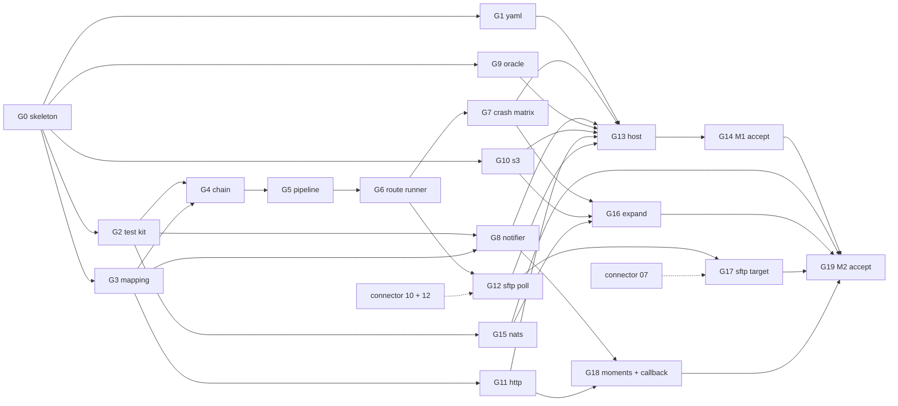

# Shuttle - The Picture

Companion to `spec.md` v0.3 and `plan.md` v0.3. The spec is the authority; this page exists so
a reader gets the shape in five minutes, knows which decisions carry the requirements, and sees
where the work is. Section numbers point into the spec.

---

## Part 1 - For everyone

### The job, as a courier route

A shuttle runs **routes**. On every route a courier does the same six things for each item:

1. **Notices** an item exists: a folder is checked every hour, or a message arrives.
2. **Picks it up**: the bytes come to a local workbench.
3. **Works on it**, optionally: check it, rename it, zip it, read a number off its label, or
   split a manifest into the items it lists.
4. **Drops it** where it belongs: a MinIO bucket, or another SFTP server.
5. **Stamps the source** so it is not picked up again: move the file, delete it, or acknowledge
   the message. This is the commit.
6. **Tells people**: at pickup, at drop, or at the stamp, through whatever channel they asked
   for. Or tells nobody.

The whole time the courier writes every step into a **logbook** (the shuttle state store, two
tables in Oracle). If the courier collapses halfway, the next one opens the logbook and
continues from the last written step.



Two routes exist today. **Vendor drop**: an SFTP folder, hourly, into MinIO, stamp by moving to
`temp/`, tell one HTTP API. **Image sets**: a NATS message naming a manifest in MinIO, the
manifest's images uploaded to a partner's SFTP server, stamp by acknowledging the message, tell
upstream at pickup and downstream at the end. A third shape, move A to B and tell nobody, is one
route with no channels.

### The three promises

| Promise | How it is kept |
|---|---|
| **Nothing is lost.** | The source is stamped only after the copy is verified at the target. A crash before the stamp leaves the item where it was, to be redone. |
| **Nobody is told too early.** | Every "tell" is written into the logbook in the same stroke as the step it announces, and a separate loop sends it. It can never be sent about something that did not happen. |
| **One bad item never stops the rest.** | Every item is handled on its own. An item that fails five times, or fails a check, is marked, left in place, and handed to an operator. Nothing is ever deleted except by a configured stamp; at the target the application only ever overwrites, and older copies expire by the bucket's own rule. |

### What can go wrong, and why it is fine

| If the courier collapses... | ...the next courier | Cost |
|---|---|---|
| before the drop is written down | picks up and drops again | one extra copy, overwritten |
| after "dropped", before the stamp | checks the copy, then stamps | none |
| after the stamp, before it is written down | sees the item is gone from the folder and writes "stamped" | the last "tell" waits one poll |
| after "stamped" is written down, before the message broker is told (message routes) | the broker sends the message again; the stamp is repeated, nothing new is told | none |
| after a "tell", before it is written down | tells again | the receiver sees the same item id twice and ignores the repeat |

Every row is a test (spec 18.2, S2 to S5).

---

## Part 2 - For engineers

### The whole system in one picture

One process, one replica. Object stores and channels are declared once; a route gives each a
role. Every route is its own supervised loop; all routes share the state store, the stores'
session pools and one notifier. The routes and the notifier never talk to each other except
through the state store and one wake signal.



Thick edges are the durable commit path; dotted edges are signals; the two memory boxes,
staging and the notifier's id set, are the only state that must not survive a restart.

### One item's journey, and the states it leaves behind

```mermaid
stateDiagram-v2
    [*] --> SEEN: trigger says it exists
    SEEN --> FETCHED: bytes in staging, digest computed
    FETCHED --> PROCESSED: chain ran, attributes frozen, mappings checked
    PROCESSED --> REJECTED: a processor said Reject
    PROCESSED --> STORED: every object stored and verified, the newest current at its key
    STORED --> ACKED: the source stamped (move · delete · ack · callback)
    ACKED --> DONE: every notification delivered, or none configured
    SEEN --> FAILED: attempts = max
    FETCHED --> FAILED: attempts = max
    PROCESSED --> FAILED: attempts = max
    STORED --> FAILED: attempts = max
    REJECTED --> SEEN: re-drive
    FAILED --> SEEN: re-drive
    DONE --> [*]

    note right of FETCHED : on: fetched → outbox row (on_state = FETCHED)
    note right of STORED : on: stored → outbox row (on_state = STORED)
    note right of ACKED : on: acked → outbox row (on_state = ACKED)
```

The ack is the **commit point** for the source. Entry points on every re-trigger are decided
from the row (spec 4.3): anything before STORED restarts from fetch, STORED verifies the copy and
acks, ACKED or DONE verifies and re-acks, REJECTED and FAILED do nothing until re-driven. A
parent with children re-runs its deterministic chain and stores only the children not yet
verified.

### Where a value travels: from a file name to a body



Attributes are the only way information leaves a processor. Every producer declares the names
it sets; every mapping row naming an attribute is checked against those declarations at boot
(rule 17) and again at attribute freeze, before the store. `shuttle try --route vendor-drop
--file-name 12345-ACME.csv` prints all of this for a sample without connecting to anything.

### The second loop: the notifier

Pending outbox rows become channel calls through a cold `Flow` with a bounded buffer and
parallel workers. Delivered rows record the receiver's reference and flip the transfer to DONE
when every row is delivered; retryable outcomes back off with jitter; rejected or exhausted rows
become FAILED without touching the transfer. Every transaction that creates rows wakes the loop;
a sweep every 30 s catches the rest. Cancelling leaves rows PENDING. The in-memory in-flight set
of ids is bounded by batch plus workers and empty when idle; it must not survive a restart.

### The five decisions that carry the requirements

| # | Decision | Requirement it carries | Spec |
|---|---|---|---|
| 1 | **One durable state store is the only truth; the two in-memory sets never survive a restart.** | No data lost; a known resume point for every item. | D1, 4.3, 4.4, I8 |
| 2 | **Ack is the commit; notifications are outbox rows created in the transaction of the state they announce.** | Nobody told too early; every tell is as durable as the step it reports. | D6, D26, I11, I20 |
| 3 | **Object stores and channels declared once, role given at the route; the target promises "the current copy is the one just written" and never deletes.** | Same server as source and target without duplicated secrets; retries overwrite, never sibling; expiry belongs to the bucket, so no transfer can erase what an earlier one delivered. | D21, D22, D5, I6 |
| 4 | **One `Processor` seam, pure over staging, attributes as its only output.** | Any processing, re-runnable after a crash, with values checked before anything is stored. | D23, D24, D25, I15, I18 |
| 5 | **Configuration as data: YAML, 25 numbered rules, validate and try modes; routes supervised.** | Operations edit and verify without a build; one dead route never takes the pod. | D29, D30, D31, D35, I14, I21 |

---

## Part 3 - The plan and the tickets

Twenty phases, two milestones. Milestone 1 ships the vendor-drop and mirror routes; milestone 2
the image-sets route. Everything from G2 to G8 is proven against the test kit with no socket and
no container; only G12 and G17 wait on the SFTP connector.



| # | Ticket | Blocked by | Nature |
|---|---|---|---|
| 01 | Skeleton, frozen surface, rules, boundary gates | none | scaffolding + rule tests |
| 02 | YAML loader and validate function | 01 | adapter |
| 03 | Test kit | 01 | concurrency in the hook driver |
| 04 | Mapping renderer and providers | 01 | pure function |
| 05 | Processing chain and built-ins | 03, 04 | state machine |
| 06 | Transfer pipeline, entry points, children | 05 | state machine |
| 07 | Route runner, reconciliation, supervision | 06 | coroutine structure |
| 08 | Crash matrix replay | 07 | state-machine reasoning |
| 09 | Notifier | 03, 04 | concurrency |
| 10 | Oracle state store | 01 | adapter |
| 11 | S3 target and fetcher | 01 | adapter |
| 12 | HTTP channel | 04 | adapter |
| 13 | SFTP poll source | 07, connector 10 + 12 | adapter |
| 14 | Quarkus host, validate and try modes, admin | 02, 08 to 13 | shutdown ordering |
| 15 | Milestone 1 acceptance | 14 | diagnosis |
| 16 | NATS channel | 03 | adapter |
| 17 | Expand, fetch, parent completion | 08, 11, 16 | state machine |
| 18 | SFTP target | 13, connector 07 | adapter |
| 19 | Notification moments and callback acks | 09, 12 | state machine |
| 20 | Milestone 2 acceptance | 15 to 19 | diagnosis |

**Frontier now:** ticket 01. After it, five open at once: 02, 03, 04, 10, 11. The tickets live
in `.scratch/shuttle/issues/`; each states what it delivers, what blocks it, the nature of the
work, and its acceptance by invariant, scenario and rule number.

### What is deliberately not here

No second replica, no expression language, no attempt-history table, no multiple targets per
route, no creation of buckets or tables, no Quarkus scheduler. Each has a named seam or a
recorded reason in spec 15 and 16. The spec wins wherever this page and it disagree.
